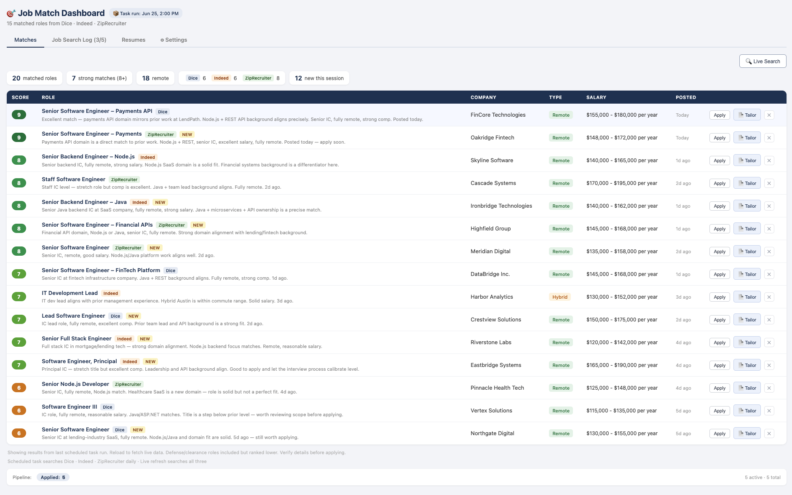
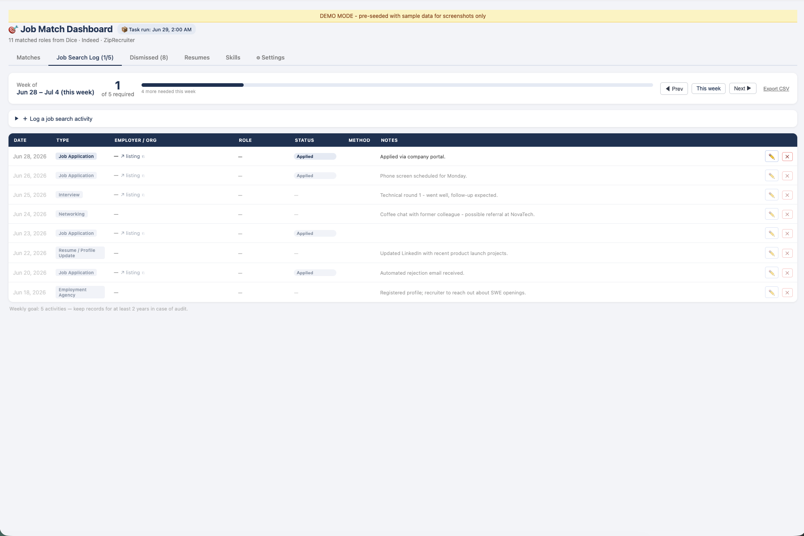
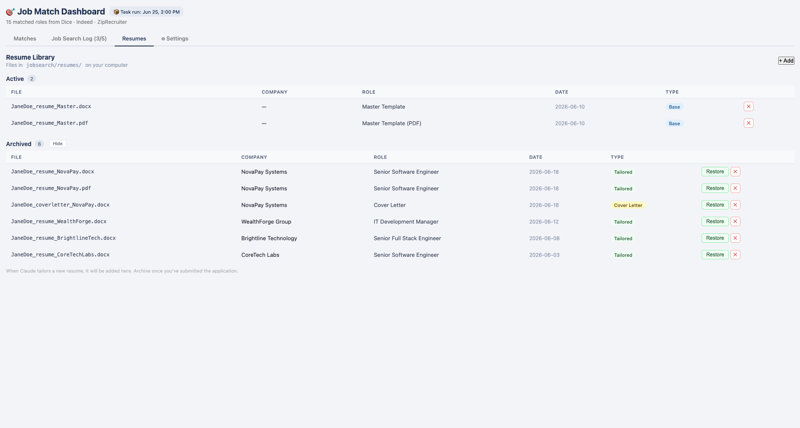
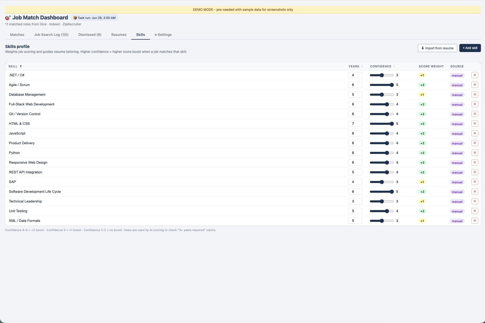
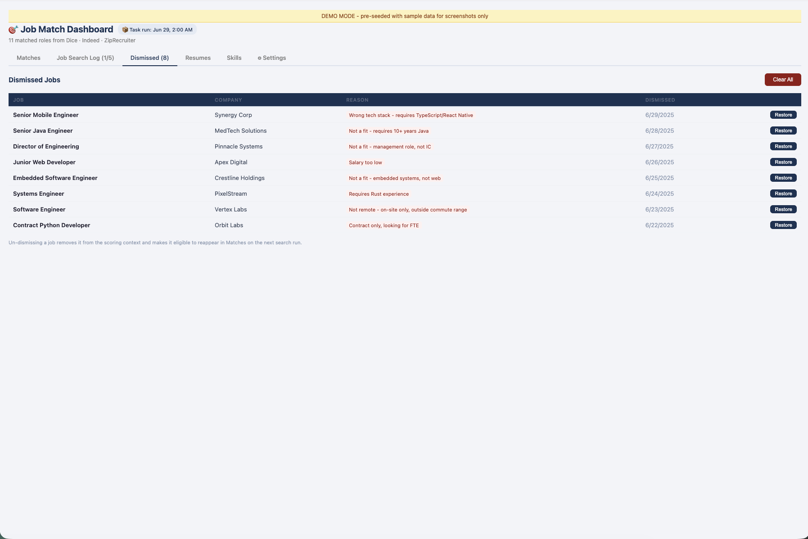
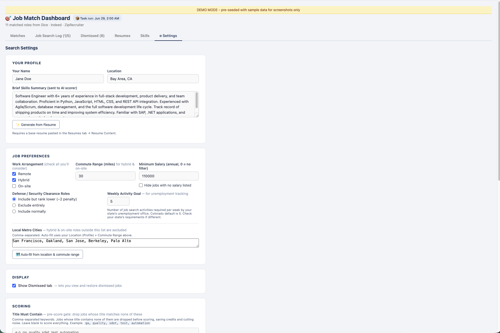

# cowork-job-scout

A self-updating job search dashboard that runs inside [Claude for Desktop](https://claude.ai/download) (Cowork mode). It searches Dice, Indeed, and ZipRecruiter daily for roles matching your profile, scores them with AI, and tracks your applications and job search activity — all in one place.

---

## What It Does

- **Daily automated search** across Dice, Indeed, and ZipRecruiter (via scheduled Claude task)
- **AI-scored matches** — each job gets a 1–10 relevance score with a plain-English reason
- **Smart filtering** — exclude defense roles, filter by salary, work arrangement, and local metro area
- **Job search log** — track applications, interviews, networking contacts, and follow-ups
- **Resume library** — keep your active and archived resumes in one tab, with tailored versions per company
- **AI resume tailoring** — ask Claude to tailor your base resume for any job directly from the dashboard
- **Live Search** — bypass the daily cache and run a fresh search on demand
- **Fully configurable** — all preferences managed in a Settings tab, no code editing required

---

## Screenshots

### Job Matches


### Job Search Log


### Resume Library


### Skills


### Dismissed Jobs


### Settings


---

## Prerequisites

1. **Claude for Desktop** with Cowork mode enabled  
   → [Download here](https://claude.ai/download)

2. **Three Cowork plugins** (install from the Plugins marketplace inside Claude):
   - **Dice** job search connector
   - **Indeed / JSearch** job search connector
   - **ZipRecruiter** job search connector

3. Your **MCP Tool IDs** (see Step 2 of Setup below)

---

## Setup

### Step 1 — Install the plugins

Open Claude for Desktop, go to **Settings → Plugins**, and install the three job board connectors listed above. Once installed, they'll appear as connected tools.

### Step 2 — Find your MCP Tool IDs

Each plugin installation gets a unique ID. You need to put yours into `dashboard.html` before creating the artifact.

Open a new Claude conversation and ask:

> "List the exact tool names available to you for searching jobs on Dice, Indeed, and ZipRecruiter."

Claude will respond with tool names in the format `mcp__{uuid}__search_jobs`. Copy the three IDs.

Then open `dashboard.html` in a text editor and find this section near the top of the `<script>` block:

```javascript
const DICE_TOOL   = 'mcp__b0b0549b-bf32-4d46-9b0c-b3315e78be7b__search_jobs'; // ← replace
const INDEED_TOOL = 'mcp__488f41d8-7ab4-4647-88f2-ba14dd0aaa6f__search_jobs'; // ← replace
const ZR_TOOL     = 'mcp__c73855fe-5ca0-4178-9fe0-23de8bc7512b__search_jobs'; // ← replace
```

Replace each value with your own IDs and save the file.

### Step 3 — Connect your job search folder

In Claude for Desktop (Cowork mode), click the folder icon in the top bar and select the folder where `dashboard.html` lives. This gives Claude access to read your base resume and save tailored resumes — both required for the tailoring workflow to work.

### Step 4 — Create the artifact in Claude

1. Open Claude for Desktop in Cowork mode
2. Open a new conversation
3. Paste the entire contents of `dashboard.html` into the message and send it with the prompt:

   > "Create a Cowork artifact from this HTML file. Use the id `job-match-dashboard`."

   Or ask Claude to read the file directly if you've given it access to this folder.

4. The artifact will appear as **🎯 Job Match Dashboard** in your conversation.

### Step 5 — Configure your profile and preferences

Click the **⚙ Settings** tab inside the dashboard and fill in:

| Section | What to fill in |
|---|---|
| **Your Profile** | Your name, location, and a description of your skills and experience (this is sent to Claude when scoring jobs) |
| **Job Preferences** | Work arrangement (remote/hybrid/on-site), commute range, minimum salary, defense role preference, and weekly activity goal |
| **Local Metro Cities** | Cities within commute range — use the **Auto-fill** button if you've set your location and commute range |
| **Search Terms** | Job titles to search for across all three boards (e.g. `senior software engineer`, `staff engineer`) |

Click **Save Settings** at the bottom when done.

Then open the **Resumes** tab and scroll down to **Resume Content** — paste your full resume as plain text. This is used by the AI scorer and the resume tailoring workflow.

Optionally, open the **Skills** tab and add your key skills with years of experience and a confidence rating (1–5). Confident skills (4–5) boost the keyword score for jobs that mention them, and the AI scorer checks whether a job's "X+ years required" matches your actual experience.

### Step 6 (Optional) — Set up the daily scheduled task

The dashboard gets much more useful with a scheduled task that runs every morning and pre-populates fresh results before you even open it.

Ask Claude to set this up:

> "Set up a daily scheduled task at 7am that searches Dice, Indeed, and ZipRecruiter for jobs matching my profile, scores them, and injects the results into my job-match-dashboard artifact."

Claude will configure this using your search settings. You can adjust the time and frequency as needed.

---

## How It Works

### Job Scoring

Each job is scored 1–10 by Claude (Haiku model) based on your profile:
- **9–10** — Excellent match, apply soon
- **7–8** — Good fit
- **5–6** — Partial match, worth reviewing
- **Below 5** — Filtered out, won't appear

### Filtering

Jobs are hidden from results if they:
- Score below 5
- Don't match your work arrangement preference
- Are outside your local metro area (for hybrid/on-site roles)
- Fall below your minimum salary (if set)
- Are defense/clearance roles (if set to exclude)
- Have no salary listed (if "Hide no-salary jobs" is checked)
- Have already been applied to or dismissed

### Preloaded vs. Live Search

When you open the dashboard, it checks whether the daily task has run recently (within 24 hours). If so, it shows those pre-scored results instantly. If not, or if you click **🔍 Live Search**, it runs fresh searches against all three job boards in real time (takes 1–2 minutes).

### Job Search Log

The **Job Search Log** tab is your activity tracker. It shows one week at a time and lets you navigate back and forward by week.

**What gets logged automatically:**

Clicking **Mark Applied** on a job in the Matches tab is the only action that creates an entry automatically. It records a *Job Application* activity with the company, role, source, and URL pre-filled, then switches to the Log tab so you can see it. The job is also removed from your Matches view so it doesn't show up again.

> **Note:** Mark Applied records that you *intend to apply* (or have applied). It does not submit an application on your behalf — you still need to open the job URL and apply through the employer's site or job board.

**What you log manually:**

Everything else. Use **＋ Log a job search activity** to add any of the following:

| Activity type | When to use it |
|---|---|
| **Job Application** | Applied to a role you found outside the dashboard |
| **Employer Contact** | Reached out to a recruiter or hiring manager cold |
| **Interview** | Phone screen, technical round, or panel interview |
| **Job Fair / Career Event** | Attended a hiring event or career fair |
| **Networking** | Coffee chat, referral conversation, LinkedIn message |
| **Employment Agency** | Registered with or contacted a staffing agency |
| **Skills Training / Workshop** | Course, certification, or skill-building activity |
| **Resume / Profile Update** | Updated your resume, LinkedIn, or portfolio |
| **Other** | Anything that doesn't fit the above |

For Job Application entries, you can also track application status (Applied → Phone Screen → Interviewing → Offer / Rejected / Withdrawn / No Response) and update it as the process moves forward.

**Weekly activity goal**

The Log tab shows a progress bar tracking how many activities you've logged in the current week against your weekly goal. The default is **5 per week**, which matches Colorado's unemployment insurance requirement. If you're in a different state, update this in **Settings → Job Preferences → Weekly Activity Goal** to match your state's requirement. Keep records of all logged activities for at least 2 years in case of a UI audit.

---

## Data Storage

All data is stored in the **browser's localStorage** inside the Cowork artifact — there's no server, no database, and no account required.

| What | localStorage key | Description |
|---|---|---|
| Job cache | `jd_job_cache` | All jobs ever seen (used for "new" badges) |
| Applications | `jd_activities` | Your full job search activity log |
| Dismissed jobs | `jd_dismissed` | Jobs you marked "Not Interested" |
| Settings | `jd_settings` | All your preferences |
| Resumes | `jd_resumes` | Resume library entries |

**Important notes:**
- Data persists between sessions as long as you use the same Cowork instance
- Dismissed jobs can be restored from the **Dismissed** tab (enable in Settings → Display)
- Data does not sync across devices

### Backup and Restore

The **Settings → Data Backup** section lets you export and restore all dashboard data as a JSON file.

**Manual export:** Click **Export Backup** to download a snapshot of all your data (activities, settings, dismissed jobs, resume library, job cache) to your Downloads folder.

**Auto-backup:** Set an interval (hourly, every 4 hours, or daily) and the dashboard will export automatically while it's open. Files are saved to your Downloads folder as `job-scout-backup-YYYY-MM-DD.json`. This only runs while the dashboard tab is open — it is not a background process.

**Restore:** Click **Import Backup**, select a previously exported `.json` file, and the dashboard will restore all data and reload. This overwrites your current data, so use it carefully.

---

## Customization

### Search Terms

The **Settings → Search Terms** section controls what gets searched on each job board. One job title per line. The dashboard automatically formats these for each service (Dice appends "remote", Indeed pairs with a location, ZipRecruiter uses as job role).

For specialized searches, expand the **Advanced** section to add extra terms per service.

### Candidate Profile

The profile in **Settings → Your Profile** is a free-text description sent to Claude when scoring jobs. The more specific you are about your skills, seniority level, and what you're looking for, the better the scores will be. Separate "core skills" from "background experience" so the AI can weigh them appropriately.

### Scoring Adjustments

Scoring is fully configurable — no need to edit code.

**Score Penalty Keywords (Settings → Scoring)**

If a job mentions technologies or industries you'd rather deprioritize, add them here as a comma-separated list (e.g. `java, selenium, playwright, c#`). Any job whose title, company name, or summary contains one of these terms will have its keyword score reduced by 1 (floor: 1). Word boundaries are respected, so `java` won't penalise jobs that only mention `javascript`.

This setting is blank by default so the dashboard works neutrally out of the box for anyone using it. Only add terms that reflect *your* stack and preferences.

**How `skills_profile.md` feeds into scoring**

The `skills_profile.md` file in your jobsearch folder is not read automatically during job scoring — it's designed for resume tailoring. However, you can use it to decide what penalty terms to add:

1. Review your `skills_profile.md` to identify technologies you have little or no experience with, or industries you want to avoid.
2. Add those as comma-separated terms in **Settings → Scoring → Score Penalty Keywords**.
3. Jobs requiring those stacks will score slightly lower, surfacing better-matched roles at the top.

This keeps the penalty logic in Settings (easy to change, personal to you) rather than hardcoded in the dashboard file.

**AI scoring prompt**

The full AI score is determined by Claude Haiku using the profile text in **Settings → Your Profile**. The more specific you are — core skills, seniority, what you're looking for — the better the AI scores will be. The penalty terms you set are also included in this prompt automatically.

**Keyword fallback**

The `keywordScore()` function in the script provides fast keyword-based scores used while AI scoring is running, and as a fallback when it fails or times out. Its built-in rules reward seniority titles, QA/automation role signals, remote positions, and Python/pytest; they penalise defense/clearance and junior-level signals. You generally don't need to modify it — use the Settings penalty terms instead.

### Defense/Clearance Roles

Set to **Penalize (−2)**, **Exclude**, or **Include normally** in Settings. The dashboard uses keyword matching on the job title, company name, and description to identify defense-adjacent roles.

---

## Resume Tailoring

The dashboard includes a resume tailoring workflow. For each job in your Matches tab, click **Tailor** to open the tailor modal. The dashboard builds a complete prompt and automatically copies it to your clipboard.

### Workflow

1. **Set up a base resume** in your jobsearch folder — a comprehensive `.docx` file that serves as your master template (not already tailored for a specific company). The recommended filename is `YourName_resume_Master.docx`. See Folder Structure below.
2. **Find a job** in the Matches tab and click the **Tailor** button next to it.
3. **The modal opens with the prompt already copied to your clipboard.** Switch to the Claude chat window and paste it in.
4. **Claude fetches the job listing** (if a URL is available), reads your base resume, and creates a tailored version — adjusting the summary, reordering bullets, and surfacing the most relevant experience. It does not fabricate anything.
5. **Claude saves the result** as both `.docx` and `.pdf` in `resumes/`, named by company (e.g. `YourName_resume_Acme.docx / .pdf`). Move it to `resumes/archived/` once you've submitted the application.
6. **Claude registers it in the Resumes tab** of the dashboard automatically.

> **Note:** The Tailor button generates a prompt and copies it to your clipboard. Due to how Cowork artifacts are sandboxed, it cannot send the prompt directly — you need to paste it into the chat yourself. 

### If No Base Resume Is Found

If Claude can't find a base resume in your jobsearch folder, it will stop and tell you exactly what it looked for. Common reasons:

- The file doesn't exist yet — create a `.docx` with your full work history and save it to your jobsearch folder
- The filename doesn't make it obvious it's a base/master resume — rename it to something like `YourName_resume_Master.docx`
- Claude doesn't have folder access — make sure your jobsearch folder is selected in Cowork mode (the folder shown in the top bar of the Claude desktop app)

### Tips for Better Tailoring

- Keep a **base resume** that's comprehensive rather than trimmed — Claude pulls from it selectively per role, so more content gives it more to work with
- Include a **skills profile** document (a plain-text file listing all your tools, domains, and years of experience) that Claude can reference without re-reading your full work history every time
- Always **review the output** before sending — Claude won't invent experience, but it may emphasize things differently than you would

---

## Skills Profile (Optional but Recommended)

For better resume tailoring, create a `skills_profile.md` file in your jobsearch folder. This gives Claude standing rules to follow every time you use the Tailor Resume workflow — things like accurate framing of your coding ability, titles you've never held, experience you don't want claimed, and job search preferences.

A starter template is included in this repo as `skills_profile_template.md`. Copy it to your jobsearch folder, rename it to `skills_profile.md`, and fill it in. Claude will find and read it automatically during resume tailoring.

The tailor modal also shows a reminder tip pointing to this file.

---

## Folder Structure (Recommended)

```
your-job-search-folder/
├── resumes/
│   ├── YourName_resume_Master.docx    ← base template
│   ├── YourName_resume_Master.pdf
│   ├── YourName_resume_Acme.docx      ← tailored (active, move to archived/ after applying)
│   └── archived/                      ← tailored resumes, post-application
├── dashboard.html                     ← this file (source of truth)
├── skills_profile.md                  ← your resume tailoring rules (optional)
└── README.md
```

---

## Troubleshooting

**Dashboard spins on "Starting searches…" and never loads**  
→ Your MCP Tool IDs are likely wrong. Re-check Step 2 above and verify the IDs match what Claude reports for your installation.

**Live Search returns no results**  
→ Check that your three plugins are connected (Settings → Plugins in Claude). Also try broadening your search terms in Settings.

**Jobs I applied to are still showing up**  
→ Make sure you're logging the application through the **Job Search Log** tab, not just externally. The dashboard filters based on its own activity log.

**Auto-fill metro cities says "Failed"**  
→ Make sure you've filled in your **Location** field in the Profile section and set a **Commute Range** before clicking Auto-fill.

**The daily task isn't injecting new jobs**  
→ Check your scheduled tasks in Claude. The task needs Cowork access to run the artifact update. Try running it manually by asking Claude to run the daily job search task.

---

## Related: Server-Based Fork

A standalone Node.js fork of this dashboard was created by **[Drew Douglass](https://github.com/DrewDouglass)**, available at **[github.com/DrewDouglass/job-scout](https://github.com/DrewDouglass/job-scout)**.

The fork is designed for users who don't have Claude for Desktop / Cowork but want similar functionality. It runs as a local server with a SQLite database, and uses different job sources.

| | This version (Cowork) | Fork (job-scout) |
|---|---|---|
| **Requires** | Claude for Desktop with Cowork mode | Node.js (local server) |
| **Job sources** | Dice, Indeed, ZipRecruiter (via Cowork plugins) | JSearch API (via RapidAPI), LinkedIn |
| **AI scoring** | Claude Haiku (built into Cowork) | Claude Haiku (your own API key) or local Ollama |
| **Storage** | Browser localStorage in artifact | SQLite database |
| **Resume tailoring** | Claude reads/writes files via Cowork | Server-side via Node.js |
| **Setup complexity** | Low — install plugins, create artifact | Medium — clone repo, run `npm start` |
| **JSearch API credits** | Not needed | Required (free tier: limited monthly searches) |
| **Works offline / no API spend** | No (requires Cowork) | Keyword scoring works without AI key |

**Which to use:** If you have Claude for Desktop with Cowork, this version is simpler to set up and doesn't require managing API keys or a local server. The fork is the better option if Cowork isn't available or you want a server-backed setup with persistent SQLite storage and local AI via Ollama.

---

## Contributing

This tool was built using Claude for Desktop (Cowork mode) as the development environment. If you've made improvements, feel free to open a PR. The entire dashboard is a single self-contained HTML file — all logic, styles, and configuration live in `dashboard.html`.

---

## License

MIT
